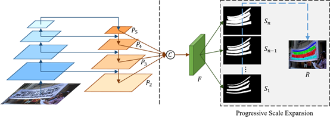

# PSENet：Shape Robust Text Detection with Progressive Scale Expansion Network

# 一、核心思想：

针对任意形状的文本以及文本行无法区分的问题，该文章：

l. 提出了一种基于基于像素级别的分割的方法psenet，能够对任意形状的文本进行定位。

2. 提出了一种渐进的尺度扩展算法，该算法可以成功地识别相邻文本实例。

# 二、网络结构：

PSENET中的backbone采用resnet，网络框架类似于FPN的结构，特征金字塔网络，整个网络的结构大致如下：

1.    首先是一个简单的ResNet的网络结构

2.    其次是类似于FPN的操作方法，生成p2~p5的fpn特征图

3.    随后的处理方法为：

1)    将p3~p5的feature map都upsample到p2的尺度

2)    不同尺度的feature map进行concat（element-wise相加）

3)    进行1x1的卷积处理，输出kernel_num个预测结果

# 三、渐进尺度扩展算法（Progressive Scale Expansion Algorithm）

渐进尺度扩展算法，基于宽度优先搜索(BFS)，由三个步骤组成：

\1.    从具有最小尺度的核开始(在此步骤中可以区分实例)，S1(上图a)代表最小kernel的分割结果，它内部有四个连通域C={c1,c2,c3,c4}，CC操作得到S1中的四个连通域，得图b（四个连通区域使用不同颜色标记,，小kernel，不同文本行之间的margin很大，很容易区分开）

\2.    将属于S2中的kernel的但不属于S1中的kernel的像素点（即图g左图中的灰色的部分）进行分配。在灰色区域（S2的kernel范围）内，将b图所找到的连通域的每个pixel以BFS的方式，逐个向上下左右扩展，即相当于把S1中预测的文本行的区域逐渐变宽（或者换种说法：对于S2中kernel的每个像素点，把它们都分别分配给S1中的某个连通域）

\3.    重复上述过程，完成直到发现最大的核做为预测结果。

# 四、标签生成

**PSENet****产生具有不同内核规模的分割结果**(例如S1；S2；...；SN)因此，它需要相应的Ground Truth。在实践中，可以简单且有效地通过缩减原始文本实例来进行这些Ground Truth标签。假设缩放的比例为ri，则pn和pi之间的margin di为：

其中Area(.)代表多边形的面积，而Perimeter(.)代表多边形的周长。

对于ri的定义为：

# 五、损失函数

损失函数定义为：

其中Lc表示整个文本实例（Sn）的损失，Ls表示缩放后文本实例（S1 -> Sn-1）的损失，λ用于平衡Lc和Ls。

论文中采用了dice coefficient损失函数;

考虑到很多文本区域和栅栏、栅格很相似，为了避免误检，这里采用了OHEM来更好的对文本区域进行区分，其中负样本-正样本的比例设置为3：1。

Lc的计算方式：

其中M代表OHEM的training mask

Ls的计算方式：

Ls主要是收缩文本区域的损失，考虑到收缩后的文本区域被原始文本区域包围，因此作者忽略了分割结果Sn中非文本区域的像素从而避免像素冗余的情况。其中W代表Sn中文本区域的mask，Sn,x,y代表Sn中(x,y)的像素值。
